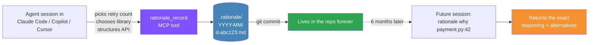
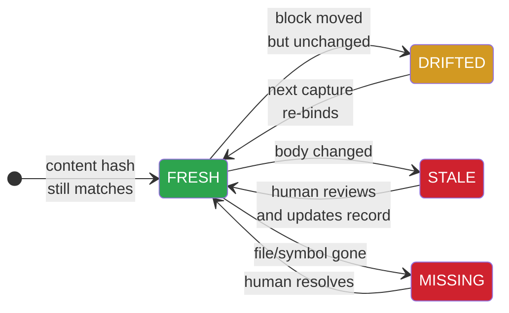
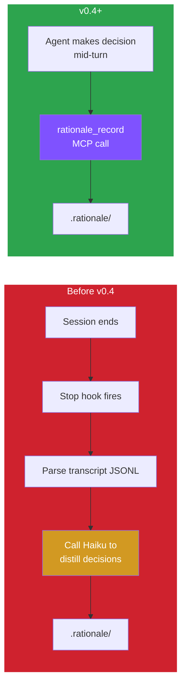

# Rationale

[](https://pypi.org/project/rationale-cli/)
[](https://pypi.org/project/rationale-cli/)
[](LICENSE)
[](https://github.com/shivam2407/rationale)
[](https://modelcontextprotocol.io)

> **`git blame` for AI-generated code.** Capture the *why* behind every non-trivial choice an AI agent makes. Anchored to lines in your repo. Queryable six months later.

AI agents ship code faster than humans can build a mental model of why it exists. Six months later, nobody — not even the person who approved the PR — can explain why a retry was set to 3, why a dependency was added, or why a function was split a particular way. The reasoning dies with the agent session.

**Rationale fixes this.** The agent records each meaningful decision *at the moment it's made*, in its own voice, into a `.rationale/` directory in your repo. You can query it from the CLI, from inside a future agent session via MCP, or gate it in CI.

---

## How it works



Every decision is a markdown file with YAML frontmatter. It's git-tracked, grep-able, and survives any platform migration.

---

## Install

### For Claude Code users (one command after pipx)

```bash
pipx install rationale-cli
```

Then inside Claude Code:

```text
/plugin marketplace add shivam2407/rationale
/plugin install rationale@rationale
```

That's it. The plugin auto-wires the Stop hook (safety-net capture), the `rationale` MCP server (runtime capture + queries), five slash commands, and a `CLAUDE.md` that tells the agent when to call `rationale_record`.

> [!TIP]
> Don't have `pipx`? `brew install pipx && pipx ensurepath` — skip the macOS-default-Python headaches.

### For every other agent (Copilot CLI, Cursor, Aider, bare CLI)

```bash
pipx install rationale-cli
```

You now have the `rationale` and `why` binaries. Wire them up:
- **Querying**: `rationale why src/payment.py:42` works anywhere, any time.
- **MCP runtime capture**: register `rationale mcp` as an MCP server in your agent's config.
- **Stop-hook capture**: only Claude Code ships a session-end hook today; for others, pipe transcripts into `rationale capture --transcript <path>`.

### From source

```bash
git clone https://github.com/shivam2407/rationale.git
cd rationale
pip install -e .
```

Requires Python 3.10+.

### Optional extras

| Extra | Install | What it unlocks |
|---|---|---|
| `[llm]` | `pipx install 'rationale-cli[llm]'` | Use the Anthropic SDK directly with `ANTHROPIC_API_KEY`. Optional — the default path uses `claude -p` from Claude Code. |
| `[crypto]` | `pipx install 'rationale-cli[crypto]'` | Ed25519 signing for EU AI Act JSON-LD exports. |
| `[mcp]` | `pipx install 'rationale-cli[mcp]'` | Pulls in the official MCP SDK (the built-in stdio server works without it). |

---

## What a decision looks like

A stored decision is a plain markdown file. Here's one:

```markdown
---
id: d-a3f9c1
timestamp: 2026-04-16T14:22:00Z
agent: claude-code
session_id: sess-7b2
git_sha: 1f3b9c2a08...
files: [src/payment.ts]
anchors:
  - file: src/payment.ts
    lines: [42, 58]
    symbol: PaymentService.retry
    content_hash: a1b2c3d4e5f6...
alternatives_considered: [exponential_backoff, circuit_breaker]
chosen: fixed 3x retry
confidence: medium
tags: [reliability, payments]
---

Downstream rate limits already cap traffic, and exponential backoff would
stretch p95 past the 800ms SLO. Circuit breaker was overkill for a single
dependency with low failure correlation.
```

---

## Querying the past

```bash
$ rationale why src/payment.ts:42

d-a3f9c1  fixed 3x retry  (exact-line)
  when:    2026-04-16T14:22:00Z
  sha:     1f3b9c2a08
  anchor:  src/payment.ts:42-58  [symbol: PaymentService.retry]
  rejected: exponential_backoff, circuit_breaker
  tags:    reliability, payments

  Downstream rate limits already cap traffic, and exponential backoff
  would stretch p95 past the 800ms SLO. Circuit breaker was overkill
  for a single dependency with low failure correlation.
```

Three query shapes work:

| Form | Example | What it matches |
|---|---|---|
| `file:line` | `rationale why src/payment.py:42` | Decisions anchored to that line (with drift tolerance). |
| `file` | `rationale why src/payment.py` | Every decision touching that file. |
| `"term"` | `rationale why "retry"` | Free-text search across decision bodies. |

Add `--json` for machine-readable output.

---

## When code changes — staleness detection



Run `rationale check` in your repo or in CI:

```bash
$ rationale check
[ok] d-a3f9c1  fresh     src/payment.ts
[~~] d-b7c4d2  drifted   src/cart.py    →  now 87-103  (symbol 'Cart.total' moved)
[!!] d-c8e1f3  stale     src/auth.py    (symbol 'validate_token' body changed)
```

Exits `1` on STALE or MISSING — drop it straight into CI.

---

## Five CLI commands cover the whole product

| Command | What it does |
|---|---|
| `rationale init` | Create `.rationale/` in the repo (optional — capture creates it lazily). |
| `rationale why <target>` | Query by `file:line`, file, or free text. |
| `rationale check` | Classify decisions FRESH / DRIFTED / STALE / MISSING. Exits 1 on problems. |
| `rationale summary` | Confidence-weighted rollups by file, agent, tag. |
| `rationale graph` | Decision relationship graph: SUPERSEDES + RELATED edges. |
| `rationale export` | JSON-LD provenance export for EU AI Act, with optional HMAC / Ed25519 signing. |
| `rationale mcp` | Run as an MCP server over stdio so agents can call the tools. |
| `rationale install-hook` | Print the Claude Code Stop hook config (for manual install). |

A short `why` shim is also installed: type `why src/x.py:42` directly.

---

## MCP tools agents can call

When `rationale mcp` is running, these tools are available to any MCP-aware agent:

| Tool | Purpose |
|---|---|
| `rationale_record` | **Primary capture path.** Agent calls this the moment it makes a non-trivial choice, passing alternatives + reasoning in its own voice. Writes directly to `.rationale/`. No LLM roundtrip, no API key. |
| `rationale_why` | Look up decisions — same `file:line` / file / free-text semantics as the CLI. |
| `rationale_list` | Every decision, newest first. |
| `rationale_check` | Classify each decision's staleness. |
| `rationale_summary` | Confidence-weighted rollups. |

> [!NOTE]
> The Claude Code plugin auto-registers this MCP server. For other agents (Copilot CLI, Cursor), add `rationale mcp` to their MCP config manually.

---

## Why runtime capture (v0.4+) beats transcript distillation



The old path needed an API key (or the `claude -p` fallback), depended on the agent "thinking out loud" in a transcript, and interpreted that thinking post-hoc. The new path captures ground truth from the agent at the moment of the choice.

The Stop hook still runs as a safety net for sessions where the agent didn't use the tool — and now prefers `claude -p` (Claude Max auth) over the SDK, so **no API key required** for a full install.

---

## Compared to other tools

| Existing tool | What it captures | What it misses |
|---|---|---|
| LangSmith / Langfuse / AgentOps | Spans, latency, tool calls in a SaaS dashboard | Not anchored to code. Lives outside the repo. |
| `claude-trace`, session logs | Per-session transcripts | Ephemeral. Not queryable across history. |
| ADR tools (adr-tools, Workik) | High-level architectural decisions | Manual. Disconnected from specific lines. |
| Agent memory (mem0, claude-mem) | Context for the *next* session | Optimized for the agent, not for a human auditing 6 months later. |
| AI Provenance Protocol | Who/when/which-model authored code | Captures authorship, not intent. |

**The gap Rationale fills:** a *code-anchored, queryable, repo-local* record of agent reasoning that survives across sessions and works across agents.

---

## EU AI Act provenance export

The EU AI Act (Aug 2026) requires operators of high-risk AI systems to document the reasoning behind AI-generated artifacts. Ship a signed JSON-LD export:

```bash
# Unsigned — good for internal audits
rationale export

# HMAC-SHA256 signature
export RATIONALE_SIGNING_KEY='a-long-random-string'
rationale export --sign --output audit.jsonld

# Ed25519 asymmetric signing for external auditors
pipx install 'rationale-cli[crypto]'
export RATIONALE_SIGNING_KEY=/path/to/private.pem
rationale export --sign --ed25519 --output audit.jsonld
```

Signatures cover canonical JSON (sorted keys, compact separators) so verification is reproducible across platforms.

---

## Configuration

| Env var | Effect |
|---|---|
| `ANTHROPIC_API_KEY` | Enables direct-SDK distillation when the Stop-hook fallback runs. Optional — `claude -p` is preferred. |
| `RATIONALE_OFFLINE=1` | Force the heuristic offline distiller. Useful in CI and air-gapped environments. |
| `RATIONALE_SIGNING_KEY` | HMAC secret (string) or path to Ed25519 PEM key. Required for `rationale export --sign`. |

---

## Roadmap

| Version | Milestone | Status |
|---|---|---|
| v0 | Claude Code Stop hook + Haiku distiller + line anchors + `why` CLI | shipped |
| v1 | Symbolic anchors (ast / regex), content-hash staleness detector, CI exit gate | shipped |
| v2 | MCP server, EU AI Act JSON-LD export with HMAC/Ed25519, decision graph, rollups | shipped |
| v3 (current) | Runtime capture via `rationale_record`, `claude -p` fallback, Claude Code plugin | **shipped** |
| post-v3 | Tree-sitter anchoring, VS Code CodeLens, Cursor extension, pure-skill distribution, Copilot CLI transcript adapter, team sync server | planned |

See [`rationale-architecture.md`](rationale-architecture.md) for the full design and [`CHANGELOG.md`](CHANGELOG.md) for release notes.

---

## Contributing

Open source under MIT. The `.rationale/` format is a spec, not a product lock-in.

```bash
pip install -e '.[dev]'
pytest
```

Pull requests welcome. New behaviour needs tests. The plugin manifests are validated by `tests/test_plugin_manifests.py` — run it before touching anything under `.claude-plugin/` or `hooks/`.

---

## License

[MIT](LICENSE) — use it anywhere, including commercial.
